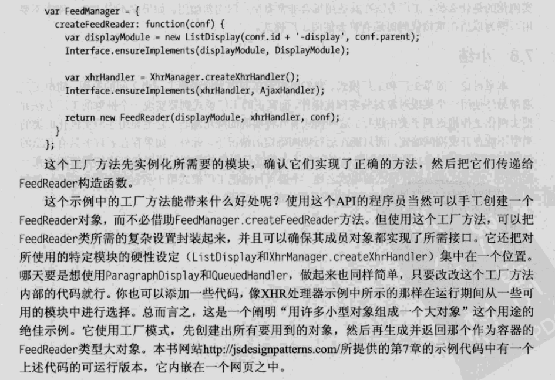

# 工厂模式

- 简单工厂模式

当一个类中有一个成员是另一个类的实例时， 如

```
class Cls1 {
  constructor() {
    this.cls = new Cls2()
  }
}

class Cls2 {
  constructor() {
    ...
  }
}
```
这样两个类就产生了耦合， 可以借助中间'工厂'来实现解耦

```
class Cls1 {
  constructor() {
    this.cls = factory.createCls()
  }
}
class Cls2 {
  constructor() {

  }
}

let Factory = {
  createCls() {
    return new Cls2()
  }
}
```

----------------------------------------------------------------------
以上是简单工厂模式， 而真正的工厂模式并不是这样

- 工厂模式

工厂模式就是将上面的factory工厂对象抽象成一个抽象类(abstract class)， 然后在子类中实现成员对象的创建
```
class Factory {
  constructor() {}

  createCls() {
    throw new Error('Unexpected operation on abstract class')
  }
}

class Cls1 extends Factory {
  constructor() {
    super()
  }

  createCls() {
    ...
  }
}
```

抽象出的工厂可以用来创建一些不同的， 但是实现了相同接口的类


### 工厂是将多个不同的类拼接在一起防止它们各自强耦合所用到的中间类


